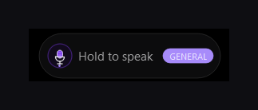
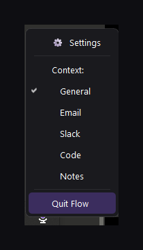
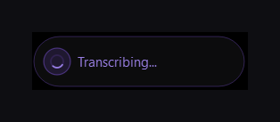
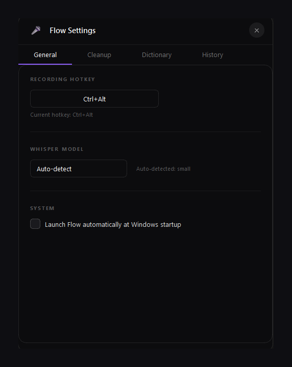
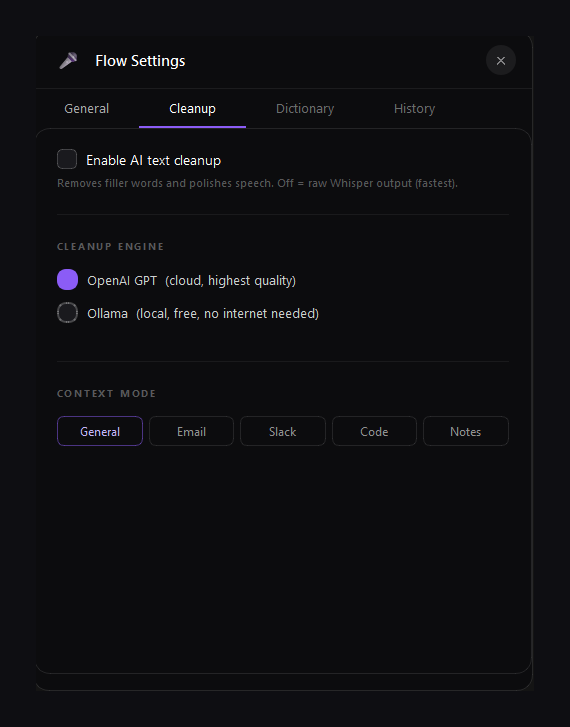
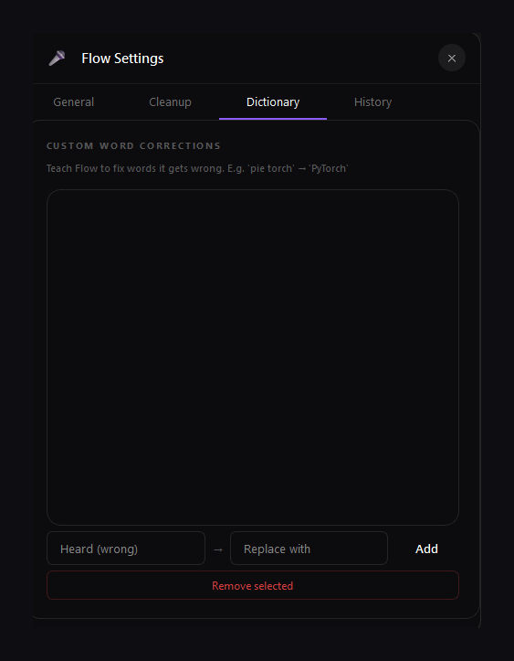
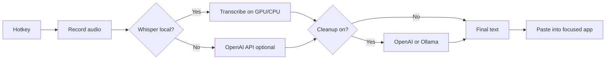

# Flow

[**GitHub → MacButtPro/flow-dictation**](https://github.com/MacButtPro/flow-dictation)

### Talk on Windows. Text lands where your cursor is.

Local **Whisper** dictation, optional **AI cleanup**, and a small floating UI you can keep out of the way.

 

[What it does](#what-it-does) · [Screenshots](#screenshots) · [Quick start](#quick-start) · [Build](#build-from-source) · [Security](#security)

 

---

## Heads up — work in progress

I’m building this in public. **Expect rough edges:** things might break on some machines, or behave oddly in certain apps. If you try it and something goes wrong, **open an issue or reach out** — I’ll do my best to fix it. Honest feedback helps a lot.

---

## What it does

**Flow** is a Windows dictation helper I made for myself and kept improving. You **hold a hotkey**, **speak**, and the app turns that into text and **drops it into whatever you’re already typing in** — browser, Slack, email, VS Code, whatever has focus.

A few things that matter to me:

- **Whisper can run on your PC** (CPU or NVIDIA GPU), so you’re not sending audio to the cloud unless you choose other options.
- **Optional cleanup**: if you turn it on, you can polish the transcript with **OpenAI** or a local **Ollama** model — or leave it off and keep raw Whisper output.
- The **floating pill** shows what’s going on (idle, transcribing, done). There’s a **tray menu** for context modes (General, Email, Slack, Code, Notes) and settings.

The look is inspired by modern “hold to talk” dictation UIs — dark, minimal, out of the way.

---

## Screenshots

These use **normalized** images (same background, padding, max width) so the README looks tidy on GitHub. Raw captures are in [`docs/readme/_source/`](docs/readme/_source/); polished files are in [`docs/readme/processed/`](docs/readme/processed/). Rebuild with: `python docs/make_readme_assets.py`.

   
  <strong>At a glance</strong> — idle → transcribing → pasted.

### In use

   
  Idle — hold your hotkey to speak; context badge shows the current mode (e.g. General).

   
  Tray menu — pick a context or open Settings.

   
  While Whisper (or the cloud path) is working.

   
  When the text made it into the target app.

### Settings

   
  <strong>General</strong> — recording hotkey, Whisper model (auto or override), launch at startup.

   
  <strong>Cleanup</strong> — optional AI polish (OpenAI cloud or Ollama local), plus context mode for how aggressive cleanup is.

   
  <strong>Dictionary</strong> — map what Whisper “hears” to what you meant (great for names and jargon).

---

## Features (short list)

- Floating dictation pill and system tray
- Global hotkey
- Local Whisper with GPU-friendly defaults when CUDA is there
- Optional OpenAI API path if you don’t run Whisper locally
- Context modes for different cleanup styles
- Optional AI cleanup (OpenAI or Ollama)
- Dictionary and recent history
- Scripts to install deps, run from source, and build `Flow.exe` (+ Inno installer if you use Inno Setup)

---

## How it works (simple)

---

## Repository layout

| Path | What it’s for |
|------|----------------|
| `flow_ui/` | App source (`flow_ui.py`), icon, tests, PyInstaller inputs |
| `docs/readme/_source/` | Raw screenshot captures (drop new PNGs here, numbered `01-…`–`07-…`) |
| `docs/readme/processed/` | README images (generated — consistent padding & width) |
| `docs/make_readme_assets.py` | Regenerates `processed/` from `_source/` |
| `INSTALL.bat` | Installs Python deps (CPU or CUDA PyTorch if you have an NVIDIA GPU) |
| `LAUNCH_FLOW.bat` | Run from source |
| `BUILD.bat` | Build `Flow.exe` and optionally the installer |
| `Flow_Setup.iss` | Inno Setup → `installer_output\Flow_Setup.exe` |
| `installer_output/` | Built installer (not committed; use **GitHub Releases** for binaries) |

---

## Quick start

1. Install [Python 3.10+](https://www.python.org/downloads/) and tick **Add Python to PATH**.
2. Run **`INSTALL.bat`**.
3. Copy `flow_ui\flow_config.example.json` to `flow_ui\flow_config.json`, or set things up in the UI.
4. Run **`LAUNCH_FLOW.bat`**.

If `nvidia-smi` works on your machine, the installer script will grab CUDA PyTorch for faster local Whisper.

---

## Build from source

1. Run **`BUILD.bat`** (it takes a while).
2. Output: `flow_ui\dist\Flow\Flow.exe`.
3. With [Inno Setup 6](https://jrsoftware.org/isinfo.php), you can get `installer_output\Flow_Setup.exe`.

---

## Security

- **`flow_config.json` is gitignored** — it can hold API keys and your history. Only **`flow_config.example.json`** belongs in the repo.
- If you ever committed a real config by mistake, rotate keys and clean git history before the repo is public.

---

## GitHub “About” (optional)

**Description:** `Windows dictation — local Whisper, optional AI cleanup, floating UI (WIP)`  

**Topics:** `windows` `dictation` `speech-to-text` `whisper` `pyqt6` `voice-typing` `productivity` `python`

---

## License

Add a `LICENSE` file when you’re ready (MIT, GPL, etc.).

---

**Flow** — *still growing; thanks for looking.*

