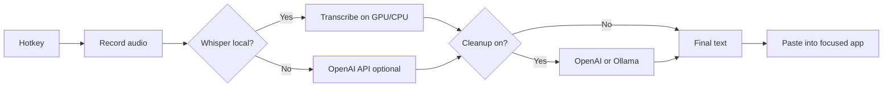

# Flow

[**Repository on GitHub**](https://github.com/MacButtPro/flow-dictation) · `MacButtPro/flow-dictation`

### Speak anywhere on Windows. Get text where your cursor is.

**Local speech-to-text** with OpenAI Whisper · **Optional AI cleanup** · **Floating overlay** inspired by modern dictation tools

 

[Features](#-features) · [How it works](#-how-it-works) · [Quick start](#-quick-start) · [Build](#-build-from-source) · [Security](#-security)

 

---

## What is Flow?

**Flow** is a desktop dictation assistant for **Windows**. Hold a hotkey, speak, and your words are transcribed and **inserted into the app you are already using**—email, Slack, VS Code, the browser, anywhere the cursor lives.

It is built for people who want **speed and privacy options in one tool**:

| | |
|---|---|
| **Privacy-first path** | Run **Whisper on your machine** (CPU or NVIDIA GPU). Audio is processed locally when you use the bundled model. |
| **Polish when you want it** | Optional **AI cleanup** removes filler words and tightens phrasing—via **OpenAI** or a local **Ollama** model. |
| **Feels like a pro tool** | A **floating pill** shows recording and processing state; a full **settings** panel covers models, hotkeys, and context modes. |

The UI follows a **Wispr Flow–style** overlay: minimal chrome, clear states, system tray control.

---

## Features

- **Floating dictation pill** — Recording, processing, and done states at a glance  
- **Global hotkey** — Start dictation without leaving your workflow  
- **OpenAI Whisper** — Local transcription; model size adapts to **GPU VRAM** when CUDA is available  
- **Cloud fallback** — If Whisper is not available, transcription can use the **OpenAI API** (optional)  
- **Context modes** — General, email, Slack, code, and notes drive different cleanup prompts  
- **AI cleanup (optional)** — OpenAI or **Ollama** for light polish; can be disabled for raw Whisper output  
- **Windows-native input** — Clipboard + **SendInput** paste path; **UI Automation** helpers for compatible controls  
- **Dictionary & history** — Per-word fixes and recent transcriptions  
- **Packaged builds** — **PyInstaller** for `Flow.exe`; **Inno Setup** script for a proper installer  

---

## How it works

---

## Repository layout

| Path | Purpose |
|------|---------|
| `flow_ui/` | Application source (`flow_ui.py`), assets, tests, PyInstaller inputs |
| `INSTALL.bat` | Installs dependencies (CPU or CUDA **PyTorch** when an NVIDIA GPU is detected) |
| `LAUNCH_FLOW.bat` | Runs the app from source |
| `BUILD.bat` | Builds `Flow.exe` and optionally the Inno Setup installer |
| `Flow_Setup.iss` | Inno Setup script → `installer_output\Flow_Setup.exe` |
| `installer_output/` | Generated installer (not committed; distribute via **GitHub Releases**) |

---

## Quick start

1. Install [Python 3.10+](https://www.python.org/downloads/) and enable **Add Python to PATH**.  
2. Run **`INSTALL.bat`**.  
3. Copy `flow_ui\flow_config.example.json` to `flow_ui\flow_config.json` (or create settings in the app).  
4. Run **`LAUNCH_FLOW.bat`**.

For GPU acceleration, `INSTALL.bat` installs CUDA-enabled **PyTorch** when `nvidia-smi` succeeds.

---

## Build from source

1. Run **`BUILD.bat`** (allow several minutes).  
2. Output: `flow_ui\dist\Flow\Flow.exe`.  
3. With [Inno Setup 6](https://jrsoftware.org/isinfo.php) installed, an installer is produced at `installer_output\Flow_Setup.exe`.

---

## Security

- **`flow_config.json` is gitignored** — it may contain API keys and transcription history. Only **`flow_config.example.json`** belongs in version control.  
- If a real config was ever committed, **rotate API keys** and scrub history before making the repository public.

---

## Screenshots

_Add a few images here (floating pill, settings, tray menu) to make the repo stand out—drag-and-drop them into your README on GitHub or place files under `docs/` and link them._

---

## Suggested GitHub metadata

Use these in the repository **About** box on GitHub:

| Field | Suggestion |
|--------|------------|
| **Description** | `Windows voice dictation with local Whisper, optional AI cleanup, and a floating overlay UI` |
| **Website** | Your landing page or docs URL (optional) |
| **Topics** | `windows` `dictation` `speech-to-text` `whisper` `pyqt6` `voice-typing` `productivity` `openai` `python` |

---

## License

Specify a license by adding a `LICENSE` file (for example MIT, GPL-3.0, or your own terms).

---

**Flow** — *Type less. Say more.*

